# Ex-03EDA

## AIM
To perform EDA on the given data set. 

# Explanation
The primary aim with exploratory analysis is to examine the data for distribution, outliers and 
anomalies to direct specific testing of your hypothesis.
 
# ALGORITHM
### STEP 1
Import the required packages(pandas,numpy,seaborn).

### STEP 2:
Read the given csv file and convert them into Dataframe.

### STEP 3:
Use drop function to remove the non-numerical columns from Dataframe.

### STEP 4:
Remove the null values from the data.

### STEP 5:
Return the objects containing counts of unique values using (value_counts()).

### STEP 6:
Plot the counts in the form of Histogram or Bar Graph.

### STEP 7:
Find the pairwise correlation of all columns in the dataframe(.corr()) and save the cleaned data to the file.

# CODE
```
import pandas as pd
import numpy as np
import seaborn as sns
df=pd.read_csv("titanic_dataset.csv")
df.info()
df.head()
df.isnull().sum()
df.drop("Cabin",axis=1,inplace=True)
df.info()
df.isnull().sum()
df["Age"]=df["Age"].fillna(df["Age"].median())
df.boxplot()
df.isnull().sum()
df["Embarked"]=df["Embarked"].fillna(df["Embarked"].mode()[0])
df["Embarked"].value_counts()
df["Pclass"].value_counts()
df["Survived"].value_counts()
sns.countplot(x="Survived",data=df)
sns.countplot(x="Pclass",data=df)
sns.countplot(x="Sex",data=df)
df.info()
sns.displot(df["Age"])
sns.displot(df["Fare"])
sns.countplot(x="Pclass",hue="Survived",data=df)
sns.displot(df[df["Survived"]==0]["Age"])
sns.displot(df[df["Survived"]==1]["Age"])
pd.crosstab(df["Pclass"],df["Survived"])
pd.crosstab(df["Sex"],df["Survived"])
df.corr()
sns.heatmap(df.corr(),annot=True)
```
# OUPUT
## INITIAL DATA : 
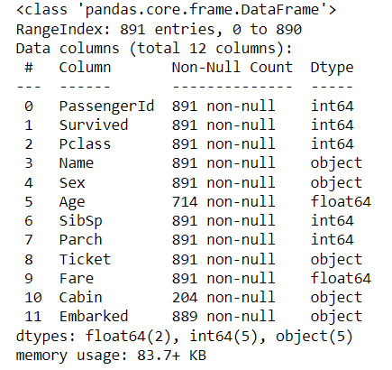
## CHECKING NULL VALUES :
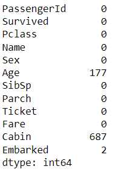
## GRAPH TO EXHIBIT OUTLIERS :
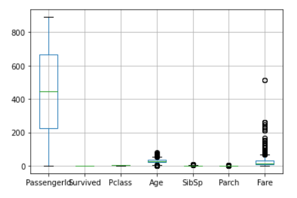
## REPLACING THE NULL VALUES :
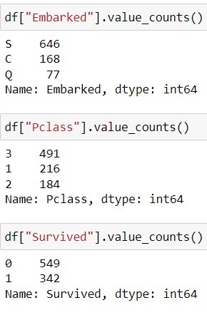
## GRAPH :
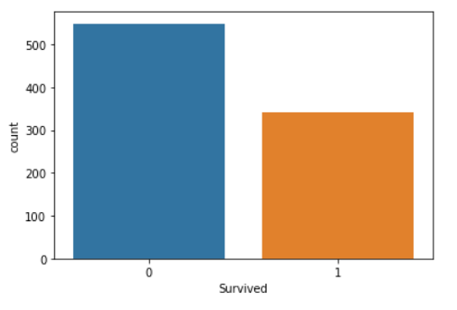
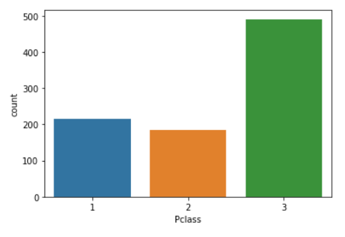
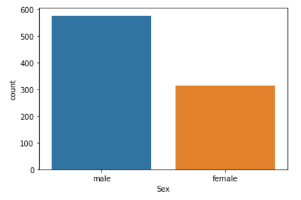
## AFTER REPLACING NULL VALUES :
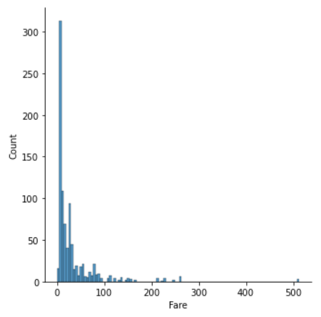
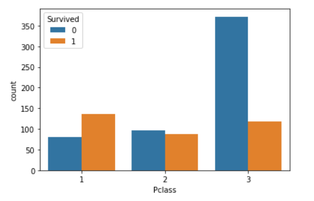
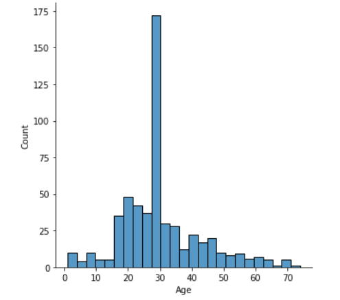
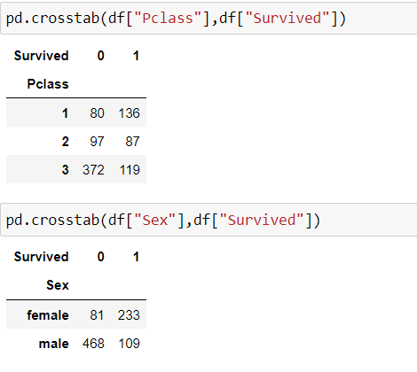
## CORRELATION BETWEEN DATA :
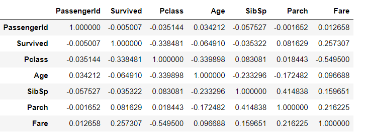
## HEAT MAP :
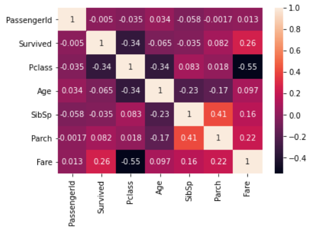

# RESULT
EDA on the given data set is performed successfully.